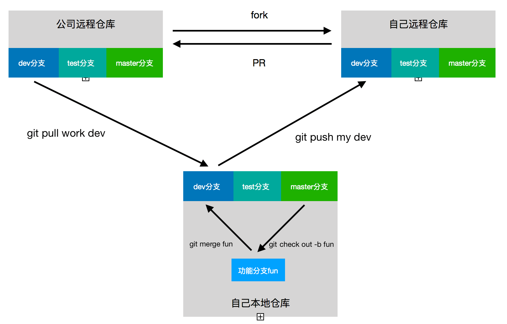

#### 常用的`git`命令

学习和工作中都是用的`git`，整理一些常用的`git`用法

一个项目如果用git，首先要git初始化（`git init`），当文件修改之后用git追踪全部文件(`git add .`)，然后写入这次文件变更的信息(`git commit -m "you_message"`)，然后用`git log`就可以在本地查看你的commit历史记录，如果在多次commit后，如果要想回到指定commit版本，执行`git reset --hard commit_id`，commit_id执行`git log`可以查找到。

实现多人协作，首先需要在github上新建一个仓库，与本地的代码关联`git remote add name ssh` name是自己对这个远程仓库在你本地取的名字，一般是origin，ssh是新建的远程仓库的ssh地址，执行命令后，远程的仓库与本地仓库已经关联了，`git remote -v`可以查看关联相关的信息。本地代码做修改后，`git add .` `git commit -m "your_message"` 后，就可以把本地代码推到远程仓库了（`git push name branch`）name是刚刚本地取的名字，branch是要推的分支名称，比如master。

在公司中，一个仓库一般会有三个基本的分支，dev分支（用于开发测试），test分支（用于测试），master分支（线上代码）。首先fork公司的项目作为自己的远程仓库，然后克隆项目到本地（`git clone ssh `）ssh是自己远程仓库的ssh地址。一般接到一个需求，首先从master分支切出一个独立分支（`git checkout -b fun`）fun是分支的名字，等到开发完成后，把分支合并到dev分支上，然后拉取更新公司远程dev分支的代码（`git pull work dev`）work是公司的远程仓库在本地的名称，dev是要拉取的分支名称，在这里如果本地没有与公司远程仓库关联，执行`git remote add work ssh`做关联。拉取公司dev分支代码后，如有冲突，解决完冲突就可以push到自己的远程仓库了（`git push my dev`）my是公自己的远程仓库在本地的名称，dev是要push的分支名称。这样就可以向公司仓库提PR了，老大审完你的代码，就可以merge到公司的dev分支啦。不同的需求一般新建不同的分支，这样既可以保证需求代码的独立性，又能同步进行开发。

当需求上线后，可以删除本地这次需求的分支（`git branch -D fun`）

有时候公司仓库新增了一些分支，查看关联仓库所有分支（`git branch -a`），也无法获取新增分支的时候，需要fetch一下（`git fetch work new_branch`）work是公司的远程仓库在本地的名称，new_branch是公司仓库新增的分支名称，然后执行查看所有分支的命令，就可以看到了，这个时候新增的分支还没有在你本地，你只需要（`git checkout -b new work/new_branch`）就可以把公司new_branch分支的代码拉到本地名字为new的分支上了。
